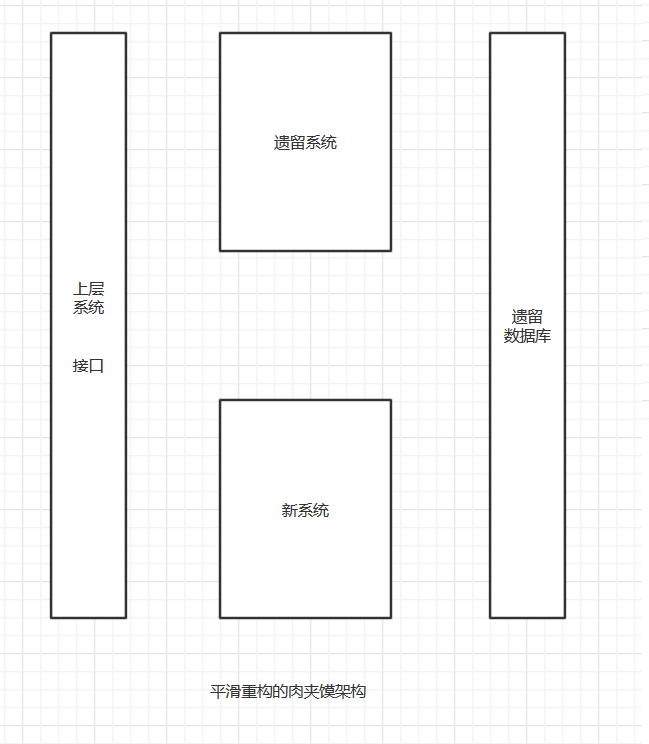
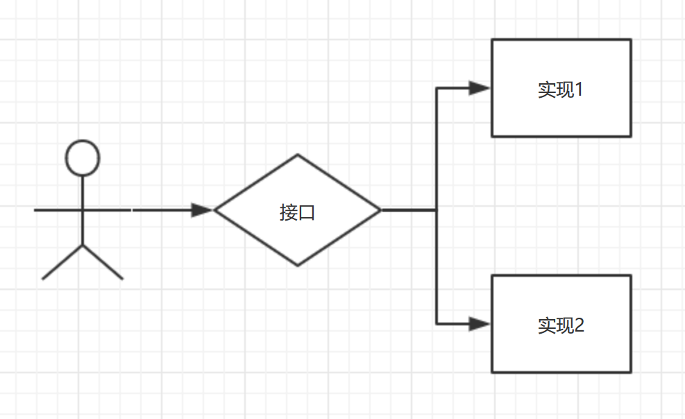

# flow-split
flow是一个接口的分流和流控的门面项目，包括以下子项目
 - flow-rpc-filter  //RPC分流
   + flow-dubbo-filter
   + flow-grpc-filter
   + ......
 - flow-rpc-balance    //RPC负载均衡，流控等
   + flow-dubbo-balance      
   + flow-grpc-balance      
   + ......      
 - flow-mq-filter   //MQ分流
   + flow-rocketmq-filter
   + ......
 - flow-mq-balance         //MQ负载均衡，流控等
   + flow-rocketmq-balance      
   + ......   
 

# 为重构而生
我们过去最大的难题，不是系统重构。而是系统的平滑重构。平滑重构基本上按照肉夹馍的方式来。

举个例子
我们不能控制用户app升级进度，必须保证对遗留接口。
我们不想改造遗留系统，这样会让风险和进度更难控制，这样数据库也最好不要动。
在上下两层不变的系统情况下，既要兼容遗留接口，又要兼容遗留数据库。这样的升级方案是最稳妥的。

可以分为几部到位

1，设计一个理想实现

2，针对遗留接口，增加一个接口适配器层

3，针对遗留数据库，增加数据库适配器层

4，新老系统同时运行，将理想接口释放出去，并针对遗留接口制定一个迁移计划

5，制定数据库迁移计划，开发新的数据库适配器层。

我们可以看到，在这中间，最关键的一步是新老系统同时运行的机制。即新老系统分流，控流。
 

分流有几种情况
1，网关分流，比如nigix，或者自研网关，接口网关
2，rpc
3，mq

